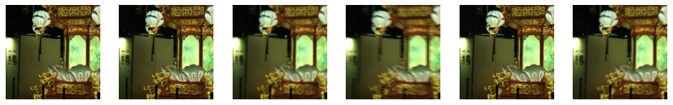
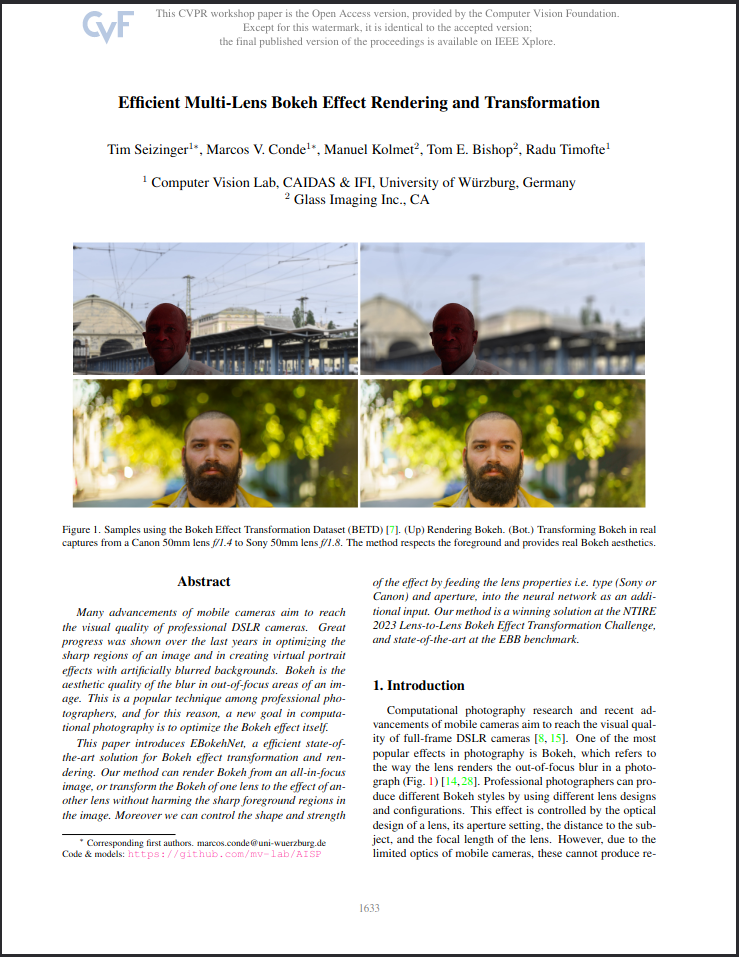
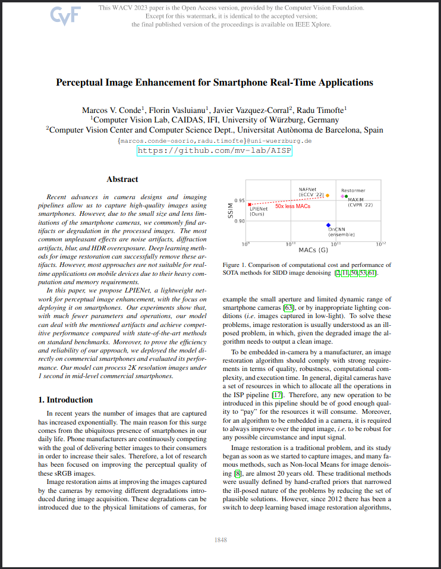
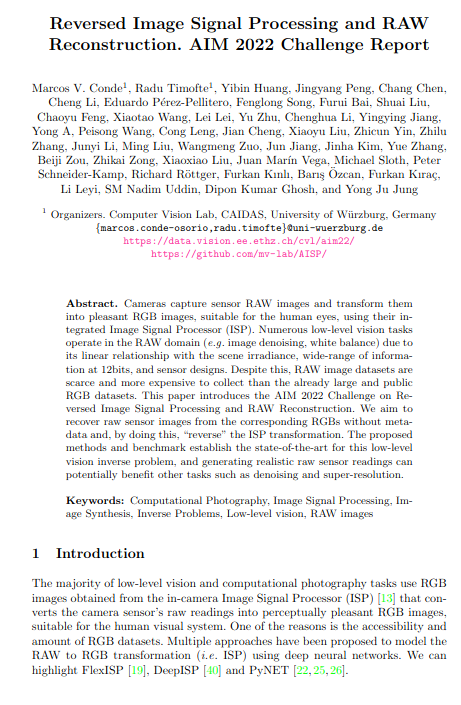
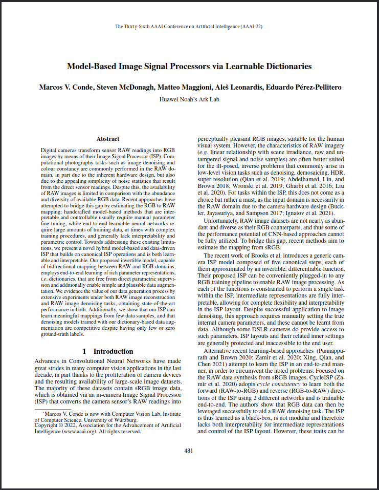
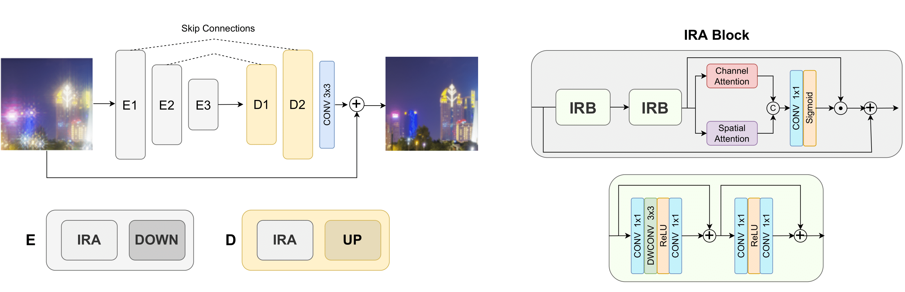
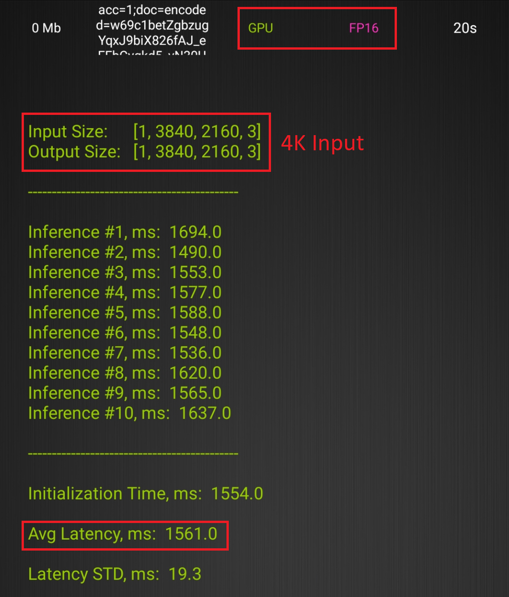
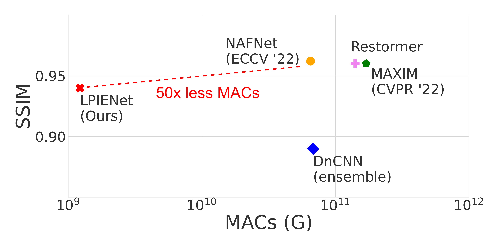
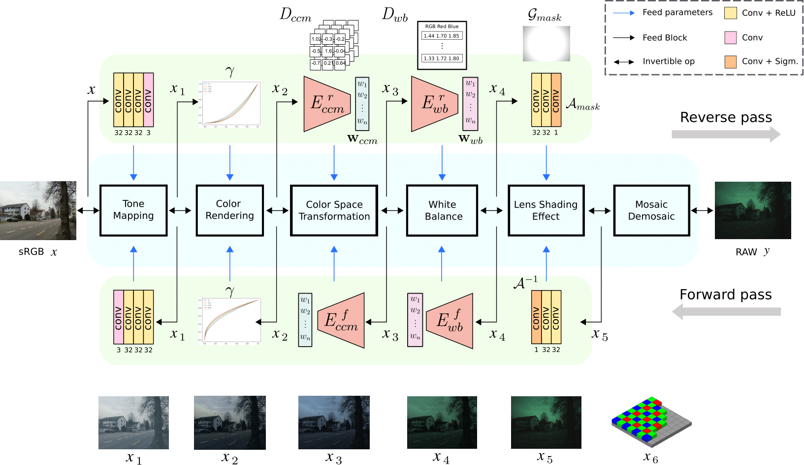
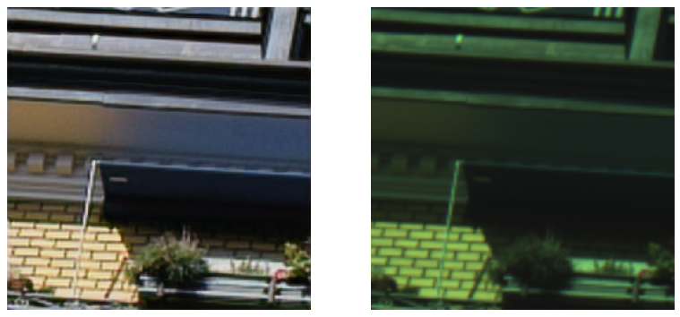

# AI Image Signal Processing and Computational Photography
## Deep learning for low-level computer vision and imaging

[](https://arxiv.org/abs/2201.03210)
[](https://arxiv.org/abs/2210.13552)
[](https://openaccess.thecvf.com/content/CVPR2023W/NTIRE/papers/Seizinger_Efficient_Multi-Lens_Bokeh_Effect_Rendering_and_Transformation_CVPRW_2023_paper.pdf)


**[Marcos V. Conde](https://scholar.google.com/citations?user=NtB1kjYAAAAJ&hl=en), [Radu Timofte](https://scholar.google.com/citations?user=u3MwH5kAAAAJ&hl=en)**

[Computer Vision Lab, CAIDAS, University of Würzburg](https://www.informatik.uni-wuerzburg.de/computervision/home/) 

---------------------------------------------------

> **Topics** This repository contains material for RAW image processing, RAW Restoration and Super-Resolution, RAW reconstruction from sRGB, learned Image Signal Processing (ISP), Image Enhancement and Restoration (denoising, deblurring), Bokeh rendering, and much more! 📷

**NEWS 🚀🚀**
- [NTIRE (New Trends in Image Restoration and Enhancement) workshop](https://www.cvlai.net/ntire/2025/) at CVPR 2025
- 🔥 This repo is back and will be updated with many more works!

<br>

----

### RAW Image Restoration, Super-Resolution and Reconstruction at NTIRE CVPR 2025

We provide code for the following challenges:
- [NTIRE 2025 RAW Restoration Challenge: Track1) Super-Resolution](https://codalab.lisn.upsaclay.fr/competitions/21644)
- [NTIRE 2025 RAW Restoration Challenge: Track2) Restoration](https://codalab.lisn.upsaclay.fr/competitions/21647)
- [NTIRE 2025 RAW Image Reconstruction from sRGB](https://codalab.lisn.upsaclay.fr/competitions/21648)

Check the tutorial for generating degraded RAW images! You can learn: how to read and visualize RAWs, add noise, blur, and downsample. Base code for training **RAW restoration, denoising and super-resolution** methods. The tutorial is at [imresutils/generate_lq.ipynb](imresutils/generate_lq.ipynb).

<a href="imresutils/generate_lq.ipynb"></a>

----

#### Official repository for the following works:

Most recent works:
- **[BSRAW: Improving Blind RAW Image Super-Resolution](https://arxiv.org/abs/2312.15487), WACV 2024**
- **[Deep RAW Image Super-Resolution. A NTIRE 2024 Challenge Survey](https://arxiv.org/abs/2404.16223), CVPRW 2024**
- **[Toward Efficient Deep Blind Raw Image Restoration](https://arxiv.org/abs/2409.18204), ICIP 2024**

1. **[Efficient Multi-Lens Bokeh Effect Rendering and Transformation](https://openaccess.thecvf.com/content/CVPR2023W/NTIRE/papers/Seizinger_Efficient_Multi-Lens_Bokeh_Effect_Rendering_and_Transformation_CVPRW_2023_paper.pdf)** at **CVPR NTIRE 2023**.
1. **[Perceptual Image Enhancement for Smartphone Real-Time Applications](https://arxiv.org/abs/2210.13552) (LPIENet) at WACV 2023.**
1. **[Reversed Image Signal Processing and RAW Reconstruction. AIM 2022 Challenge Report](aim22-reverseisp/) ECCV, AIM 2022**
1. **[Model-Based Image Signal Processors via Learnable Dictionaries](https://arxiv.org/abs/2201.03210) AAAI 2022 Oral**
1. [MAI 2022 Learned ISP Challenge](#mai-2022-learned-isp-challenge) Complete Baseline solution
1. [Citation and Acknowledgement](#citation-and-acknowledgement) | [Contact](#contact) for any inquiries.


|  |  |  |  |
|:--- |:--- |:--- |:---|
| <a href="https://openaccess.thecvf.com/content/CVPR2023W/NTIRE/papers/Seizinger_Efficient_Multi-Lens_Bokeh_Effect_Rendering_and_Transformation_CVPRW_2023_paper.pdf"></a>  | <a href="https://arxiv.org/abs/2210.13552"></a>  | <a href="https://arxiv.org/abs/2210.11153"></a>  | <a href="https://arxiv.org/abs/2201.03210"></a>
|  |  |  |  |

-----
## [Efficient Multi-Lens Bokeh Effect Rendering and Transformation](ebokeh/) (CVPRW '23) 

This work is the state-of-the-art method for bokeh rendering and transformation and baseline of the NTIRE 2023 Bokeh Challenge.

Read the full paper at: [Efficient Multi-Lens Bokeh Effect Rendering and Transformation](https://openaccess.thecvf.com/content/CVPR2023W/NTIRE/papers/Seizinger_Efficient_Multi-Lens_Bokeh_Effect_Rendering_and_Transformation_CVPRW_2023_paper.pdf)


------

## [Perceptual Image Enhancement for Smartphone Real-Time Applications](https://arxiv.org/abs/2210.13552) (WACV '23)

*This work was presented at the IEEE/CVF Winter Conference on Applications of Computer Vision (WACV) 2023.*

> Recent advances in camera designs and imaging pipelines allow us to capture high-quality images using smartphones. However, due to the small size and lens limitations of the smartphone cameras, we commonly find artifacts or degradation in the processed images e.g., noise,  diffraction artifacts, blur, and HDR overexposure. 
We propose LPIENet, a lightweight network for perceptual image enhancement, with the focus on deploying it on smartphones.

The code is available at **[lpienet](lpienet/)** including versions in Pytorch and Tensorflow. We also include the model conversion to TFLite, so you can generate the corresponding `.tflite` file and run the model using the `AI Benchmark` app on android devices.
In *[lpienet-tflite.ipynb](lpienet/lpienet-tflite.ipynb)* you can find a complete tutorial to transform the model to tflite.

**Contributions**
- The model can process 4K images under 1s on commercial smartphones.
- We achieve competitive results in comparison to SOTA methods in relevant benchmarks for denoising, deblurring and HDR correction. For example the SIDD benchmark.
- We reduce NAFNet number of MACs (or FLOPs) by 50 times.

 <details>
  <summary>Click here to read the abstract</summary>
  <p>Recent advances in camera designs and imaging pipelines allow us to capture high-quality images using smartphones. However, due to the small size and lens limitations of the smartphone cameras, we commonly find artifacts or degradation in the processed images. The most common unpleasant effects are noise artifacts, diffraction artifacts, blur, and HDR overexposure. Deep learning methods for image restoration can successfully remove these artifacts. However, most approaches are not suitable for real-time applications on mobile devices due to their heavy computation and memory requirements.
  
  In this paper, we propose LPIENet, a lightweight network for perceptual image enhancement, with the focus on deploying it on smartphones. Our experiments show that, with much fewer parameters and operations, our model can deal with the mentioned artifacts and achieve competitive performance compared with state-of-the-art methods on standard benchmarks. Moreover, to prove the efficiency and reliability of our approach, we deployed the model directly on commercial smartphones and evaluated its performance. Our model can process 2K resolution images under 1 second in mid-level commercial smartphones.
  <br>
  </p>
</details> 
<br>


<a href="https://arxiv.org/abs/2210.13552"></a>


|  |  |
| :--- | :--- |
|   |  |
|  |  |

<br>

------

## [Model-Based Image Signal Processors via Learnable Dictionaries](https://mv-lab.github.io/model-isp22/) (AAAI '22 Oral)

*This work was presented at the 36th AAAI Conference on Artificial Intelligence, Spotlight (15%)*

[Project website](https://mv-lab.github.io/model-isp22/) where you can find the poster, presentation and more information.

> Hybrid model-based and data-driven approach for modelling ISPs using learnable dictionaries. We explore RAW image reconstruction and improve downstream tasks like RAW Image Denoising via raw data augmentation-synthesis.


<a href="https://ojs.aaai.org/index.php/AAAI/article/view/19926/19685"></a>


If you have implementation questions or you need qualitative samples for comparison, please contact me. You can download the figure/illustration of our method in [mbispld](mbispld/mbispld.pdf).

<br>

------

## [AIM 2022 Reversed ISP Challenge](aim22-reverseisp/) 

This work was presented at the European Conference on Computer Vision (ECCV) 2022, AIM workshop.

### [Track 1 - S7](https://codalab.lisn.upsaclay.fr/competitions/5079) | [Track 2 - P20](https://codalab.lisn.upsaclay.fr/competitions/5080)

<a href="https://data.vision.ee.ethz.ch/cvl/aim22/"></a>

In this challenge, we look for solutions to recover RAW readings from the camera using only the corresponding RGB images processed by the in-camera ISP. Successful solutions should generate plausible RAW images, and by doing this, other downstream tasks like Denoising, Super-resolution or Colour Constancy can benefit from such synthetic data generation. Click [here to read more information](aim22-reverseisp/README.md) about the challenge.

### Starter guide and code 🔥

- **[aim-starter-code.ipynb](aim22-reverseisp/official-starter-code.ipynb)** - Simple dataloading and visualization of RGB-RAW pairs + other utils.
- **[aim-baseline.ipynb](aim22-reverseisp/official-baseline.ipynb)** - End-to-end guide to load the data, train a simple UNet model and make your first submission!

------


## [MAI 2022 Learned ISP Challenge](https://codalab.lisn.upsaclay.fr/competitions/1759)

You can find at [mai22-learnedisp](mai22-learnedisp/) and end-to-end baseline: dataloading, training top solution, model conversion to tflite.
The model achieved 23.46dB PSNR after training for a few hours. Here you can see a sample RAW input and the resultant RGB.



We test the model on AI Benchmark. The model average latency is 60ms using an input RAW image `544,960,4` and generating a RGB `1088,1920,3`, in a mid-level smartphone (45.4 AI-score) using Delegate GPU and FP16.


-----------------

## Citation and Acknowledgement

```
@inproceedings{conde2022model,
  title={Model-Based Image Signal Processors via Learnable Dictionaries},
  author={Conde, Marcos V and McDonagh, Steven and Maggioni, Matteo and Leonardis, Ales and P{\'e}rez-Pellitero, Eduardo},
  booktitle={Proceedings of the AAAI Conference on Artificial Intelligence},
  volume={36},
  number={1},
  pages={481--489},
  year={2022}
}

@inproceedings{conde2022aim,
  title={{R}eversed {I}mage {S}ignal {P}rocessing and {RAW} {R}econstruction. {AIM} 2022 {C}hallenge {R}eport},
  author={Conde, Marcos V and Timofte, Radu and others},
  booktitle={Proceedings of the European Conference on Computer Vision Workshops (ECCVW)},
  year={2022}
}
```


## Contact

Marcos Conde (marcos.conde@uni-wuerzburg.de) is the contact persons and co-organizer of NTIRE and AIM challenges.
