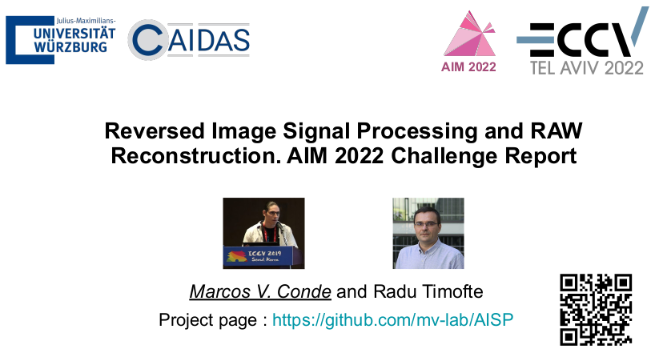
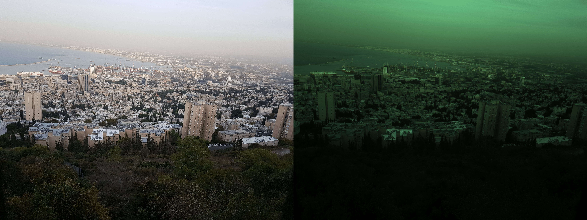
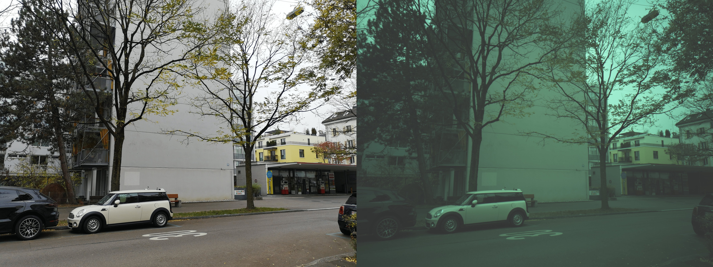
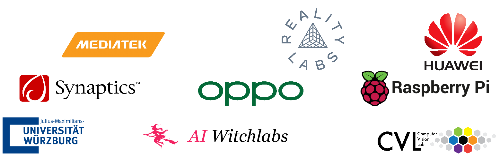

# [AIM 2022 Reversed ISP Challenge @ ECCV 2022](https://data.vision.ee.ethz.ch/cvl/aim22/) 

## [Reversed Image Signal Processing and RAW Reconstruction. AIM 2022 Challenge Report](https://arxiv.org/abs/2210.11153)

### [Track 1 - S7](https://codalab.lisn.upsaclay.fr/competitions/5079) | [Track 2 - P20](https://codalab.lisn.upsaclay.fr/competitions/5080)


------------------

**News 🚀🚀**

- More updates soon
- [10/2022] The presented papers and material from the AIM workshop can be found at [aim-material ](aim-material/). The code from the top solutions is available at [teams](teams/) here.
- [10/2022] The challenge report is public at [Reversed Image Signal Processing and RAW Reconstruction. AIM 2022 Challenge Report](https://arxiv.org/abs/2210.11153)
- [10/2022] [Advances in Image Manipulation (AIM) workshop](https://data.vision.ee.ethz.ch/cvl/aim22/), ECCV 2022, Tel Aviv. IS ON 🔥


<a href="aim-material/AIM 2022 Reversed ISP Challenge.pdf"></a>

------------------


### Introduction

<a href="https://data.vision.ee.ethz.ch/cvl/aim22/"></a>

Digital cameras transform sensor RAW readings into RGB images by means of their Image Signal Processor (ISP). Computational photography tasks such as image denoising and colour constancy are commonly performed in the RAW domain, in part due to the inherent hardware design, but also due to the appealing simplicity of noise statistics that result from the direct sensor readings. Despite this, the availability of RAW images is limited in comparison with the abundance and diversity of available RGB data. Recent approaches have attempted to bridge this gap by estimating the RGB to RAW mapping [1-5].

In this challenge, we look for solutions to recover RAW readings from the camera using only the corresponding RGB images processed by the in-camera ISP. Successful solutions should generate plausible RAW images, and by doing this, other downstream tasks like Denoising, Super-resolution or Colour Constancy can benefit from such synthetic data generation.

### Starter guide and code 🔥

- **[compare-methods.ipynb](compare-methods.ipynb)** - Visual comparison of challenge methods for RAW images reconstruction using different selected images.
- **[aim-baseline.ipynb](official-baseline.ipynb)** - End-to-end guide to load the data, train a simple UNet model and make your first submission!
- **[aim-starter-code.ipynb](official-starter-code.ipynb)** - Simple dataloading and visualization of RGB-RAW pairs + other utils.

We also provide the baseline pretrained [baseline-ckps](baseline-ckps) and other utils like the scoring scripts.
You can download here a [track 1](https://drive.google.com/file/d/1RmIqB48jeS6HZuf2x2_DUqI9IssOEWNI/view?usp=sharing) and [track 2](https://drive.google.com/file/d/1AlG3WbZtCztpgMkw5S3cAwZYOyU5Wpyq/view?usp=sharing) dummy submissions.
If you want to double-check your submission please check [scoring/evaluation.py](scoring/evaluation.py), it is important to save properly the RAW images as indicated. Read more details below.

<a href="[https://ibb.co/ckVNydX](https://codalab.lisn.upsaclay.fr/competitions/5079)"></a>


### Datasets

**Samsung S7 DeepISP Dataset**

We use a custom version of the dataset collected by Schwartz et al. in their work *[DeepISP: Learning End-to-End Image Processing Pipeline](https://arxiv.org/abs/1801.06724)*. We process the original RAW images (GRBG pattern) and extract "aligned" RGB-RAW pairs (patches).




**ETH Huawei P20 Dataset**

We use a custom version of the dataset from [ETH PyNET by Ignatov et al.](http://people.ee.ethz.ch/~ihnatova/pynet.html#dataset), a large-scale dataset consisting of RAW-RGB image pairs captured in the wild with the Huawei P20 camera (12.3 MP Sony Exmor IMX380 sensor).
More information in their paper *[Replacing Mobile Camera ISP with a Single Deep Learning Model](https://arxiv.org/abs/2002.05509)*



**Data Structure**

In both tracks, we provide RAW and RGB images extracted from the camera ISP. 
- RAW images are provided in `.npy` format, as 4-channel images following the RGGB pattern
- RGB images are provided in `.jpg` format

You can download the competition data after registering at the challenge [here](https://codalab.lisn.upsaclay.fr/competitions/5079).

The data sctructure should be as follows:

```
├── data-p20
│   ├── train
│   └── val_rgb
└── data-s7
    ├── train
    └── val_rgb
```

`data-p20` should be around 3 Gb and `data-s7` should be around 2.5 Gb

- `train/` contains RGBs in `.jpg` format and RAWs in `.npy` format
- `val_rgb/` contains RGBs in `.jpg`

From the corresponding RGBs, you need to reverse the ISP operations an provide the corresponding RAW image.

For each track, the training / validation split is as follows:
- track 1:  Training samples: 4320 	 Validation samples: 480
- track 2:  Training samples: 5760 	 Validation samples: 720

### Hints and Tips

- RAW images are provided as `np.uint16` with max value `2**10 = 1024`. 
- The RAW images are packed as (h,w,4) , you can unpack it and obtain a (h*2, w*2,1) RAW using the corresponding utils. We recommend to use the 4-channel RAW image.
- RAW images are already converted to standard RGGB pattern.
- Mosaic and Demosaic functions are provided for visualization purposes only.
- For the S7 dataset, most of the images are well-aligned, SSIM and PSNR should work as perceptual metrics.
- For the HP20 dataset, most of the images are **not** aligned. The RGB from the ISP is the process of many transformations including cropping and zooming. Therefore, in this track we recommend perceptual losses as SSIM, MSSSIM and KL-Divergence. In this track, we focus on SSIM as standard metric, but we will consider internally the other mentioned metrics. 
- The ISP corrects many artifacts such as noise and blur. The original RAW images threfore might contain such artifacts.

-------------

## Citation and Acknowledgement

```
@inproceedings{conde2022model,
  title={Model-Based Image Signal Processors via Learnable Dictionaries},
  author={Conde, Marcos V and McDonagh, Steven and Maggioni, Matteo and Leonardis, Ales and P{\'e}rez-Pellitero, Eduardo},
  booktitle={Proceedings of the AAAI Conference on Artificial Intelligence},
  volume={36},
  number={1},
  pages={481--489},
  year={2022}
}

@inproceedings{conde2022aim,
  title={{R}eversed {I}mage {S}ignal {P}rocessing and {RAW} {R}econstruction. {AIM} 2022 {C}hallenge {R}eport},
  author={Conde, Marcos V and Timofte, Radu and others},
  booktitle={Proceedings of the European Conference on Computer Vision Workshops (ECCVW)},
  year={2022}
}
```


## Contact

Marcos Conde (marcos.conde-osorio@uni-wuerzburg.de) and Radu Timofte (radu.timofte@uni-wuerzburg.de) are the contact persons and direct managers of the AIM challenge. Please add in the email subject "AIM22 Reverse ISP Challenge" or "AISP"


## AIM 2022 Sponsors


